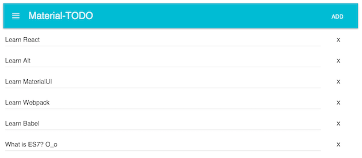

# React-Material-ToDo 
This is a demo application to try and learn some new js technologies (listed below). I think i will modify it until my tech-gremlin becomes full. Any comments and corrections are welcome.



## What's inside?
* [React](https://facebook.github.io/react/)
* [Alt](http://alt.js.org/)
* [MaterialUI](http://material-ui.com/)
* [Webpack](http://webpack.github.io/)
* [Babel](https://babeljs.io/)

Thanks to [SurviveJS](http://survivejs.com/) for such a nice book.

## Install & Run
You got to complete steps below

* Install `node.js`and `npm`
* Go to you project folder and write commands at terminal. They will install all necessart dependicies and start a development server with webpack.

```bash 
npm install
npm start
```
* Ready to go... `http://127.0.0.1:8080/ `

##Notes
If you look at ,

* `package.json` you can see necessary dependencies and start command.
* `webpack.config.js` you can see all loader, build and development configurations plugins. 
* `webpack` will start you a `hotmodulereplacement` and `babel` integrated development server. It means if you edit your js files babel will translate , webpack will pack and load it in to your browser on every change. Smooth way to code frontend.


